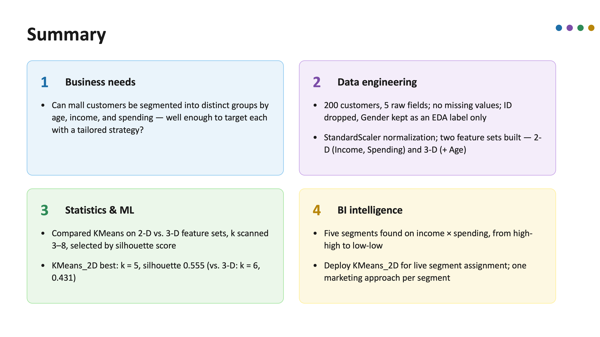

# UCLA Admission Prediction

**Predicting Graduate Admission Likelihood: A Neural-Network Classification Study of Applicant Profiles**

DongHwan Won | Dylan H. Won — 06 Aug 2026

## Summary


## Business Question
Can a graduate applicant's admission outcome be predicted from their academic and research profile, well enough to flag likely-admitted applicants for expedited review while routing borderline cases to a human reader?

Admissions committees commonly rely on a fixed GPA or test-score cutoff, or read every application with the same depth of scrutiny regardless of how clearly it falls above or below the bar. Such coarse approaches ignore how test scores, GPA, and qualitative factors such as SOP/LOR strength and research experience interact, and risk inconsistent screening decisions under time pressure.

## Business Intelligence: streamlit site
[< Streamlit  URL>](https://admissionuniv-3vpe6yvgzgczpmxc2ptqpl.streamlit.app)

## Conclusion

On 500 graduate applicants, a deeper two-layer MLPClassifier (8, 4 units) outperforms two shallower single-layer alternatives (ReLU and tanh, both 3 units), achieving **0.920** test accuracy with the smallest train–test gap (+0.015) and the most stable cross-validated score of the three (mean 0.9225, std 0.0215). On the 100-applicant held-out set it produces 65 true negatives, 4 false positives, 4 false negatives and 27 true positives — precision/recall of 0.94/0.94 on the majority "unlikely" class and 0.87/0.87 on the minority "likely admitted" class — so the model is not simply defaulting to the majority class to inflate accuracy. CGPA, TOEFL, and GRE emerge as the strongest correlates of admission (r = 0.742 / 0.699 / 0.684), motivating a deployment that pairs each applicant's predicted likelihood with these top factors rather than returning a bare accept/reject call. Because the target is a proxy probability rather than a confirmed admissions outcome, and because the held-out test set is modest and imbalanced, the model is deployed as a screening aid that routes borderline predictions to human review rather than a final decision-maker. Future work should validate against real admissions-committee outcomes where available, audit predictions for disparate impact across demographic groups not present in this dataset, and periodically recalibrate the 0.8 threshold as applicant pools shift.

#### References
[1] A. Waters and R. Miikkulainen, “GRADE: Machine learning support for graduate admissions,” AI Magazine, vol. 35, no. 1, pp. 64–75, 2014.
[2] C. Shearer, “The CRISP-DM model: The new blueprint for data mining,” J. Data Warehousing, vol. 5, no. 4, pp. 13–22, 2000.
[3] D. E. Rumelhart, G. E. Hinton, and R. J. Williams, “Learning representations by back-propagating errors,” Nature, vol. 323, pp. 533–536, 1986.
[4] K. Hornik, M. Stinchcombe, and H. White, “Multilayer feedforward networks are universal approximators,” Neural Networks, vol. 2, no. 5, pp. 359–366, 1989.
[5] D. P. Kingma and J. Ba, “Adam: A method for stochastic optimization,” in Proc. 3rd Int. Conf. Learning Representations (ICLR), 2015.
[6] F. Pedregosa et al., “Scikit-learn: Machine learning in Python,” J. Mach. Learn. Res., vol. 12, pp. 2825–2830, 2011.
[7] Streamlit Inc., “Streamlit documentation.” [Online]. Available: https://admissionuniv-3vpe6yvgzgczpmxc2ptqpl.streamlit.app

## Project Structure

```text
ML04_admission_univ/
├── data/
│   └── Admission.csv                      # Raw graduate applicant dataset (500 applicants)
│
├── python/
│   ├── admission_analysis.py              # Main analysis pipeline
│   ├── stage0.py                          # Shared utilities and configuration
│   ├── stage1.py                          # Column cleanup, target binarization at 0.8, identifier drop
│   ├── stage2.py                          # One-hot encoding, 80/20 stratified split, MinMaxScaler, EDA
│   ├── stage3.py                          # MLP architecture training and comparison
│   └── stage4.py                          # Deployment outputs and insights
│
├── results/
│   ├── csv/
│   │   ├── clean_admission_data.csv
│   │   ├── cleaned_df.csv
│   │   ├── model_comparison.csv
│   │   └── test_predictions.csv
│   ├── txt/
│   │   └── neural_network_report.txt
│   ├── visual/
│   │   ├── accuracy_comparison.png
│   │   ├── confusion_matrices.png
│   │   ├── EDA_feature_distributions.png
│   │   ├── EDA_heatmap.png
│   │   ├── loss_curves.png
│   │   ├── target_distribution.png
│   │   └── train_vs_test_accuracy.png
│   ├── Admission_Scaler.pkl               # Fit on the training split only
│   ├── MLP_deep_8_4_Model.pkl             # Deployed model (test accuracy 0.920)
│   ├── MLP_relu_Model.pkl
│   └── MLP_tanh_Model.pkl
│
├── ppt/
│   ├── Admission_Prediction.pptx          # Presentation deck
│   └── Admission_Prediction_Fun.pptx      # Presentation deck (narrative version, with speaker notes)
│
├── report/
│   ├── Admission_Prediction_IEEE_Report.pages  # Final project report (Pages)
│   └── Admission_Prediction_IEEE_Report.pdf    # Final project report (PDF)
│
├── slide/
│   └── summary.png                        # Project summary image (embedded above and in the app's Summary)
│
├── requirements.txt
├── streamlit_app.py                       # Streamlit prediction application (four tabs, reads results/ only)
└── README.md                              # Project documentation
```
